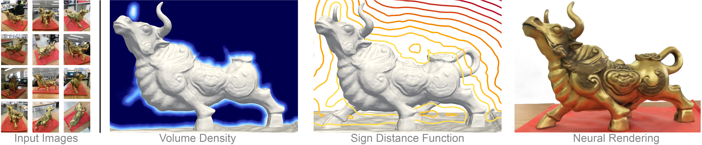

# Volume Rendering of Neural Implicit Surfaces

### [Project Page](https://lioryariv.github.io/volsdf/) | [Paper](https://arxiv.org/abs/2106.12052) | [Data](https://www.dropbox.com/sh/oum8dyo19jqdkwu/AAAxpIifYjjotz_fIRBj1Fyla)

<p align="center">
  
</p>

This repository contains an implementation for the NeurIPS 2021 paper:<br>
<a href="https://arxiv.org/abs/2106.12052">Volume Rendering of Neural Implicit Surfaces</a> <br>
<a href="https://lioryariv.github.io/" target="_blank">Lior Yariv</a><sup>1</sup>,  <a href="https://jiataogu.me/" target="_blank">Jiatao Gu</a><sup>2</sup>, <a href="http://www.wisdom.weizmann.ac.il/~/ykasten/" target="_blank">Yoni Kasten</a><sup>1</sup>, <a href="http://www.wisdom.weizmann.ac.il/~ylipman/" target="_blank">Yaron Lipman</a><sup>1,2</sup> <br>
<sup>1</sup>Weizmann Institute of Science, <sup>2</sup>Facebook AI Research

The paper introduce <b>VolSDF</b>: a volume rendering framework for implicit neural surfaces, allowing to learn high fidelity geometry from a sparse set of input images.

## Setup
#### Installation Requirmenets
The code is compatible with python 3.8 and pytorch 1.7. In addition, the following packages are required:  
numpy, pyhocon, plotly, scikit-image, trimesh, imageio, opencv, torchvision.

You can create an anaconda environment called `volsdf` with the required dependencies by running:
```
conda env create -f environment.yml
conda activate volsdf
```

#### Data

We apply our multiview surface reconstruction model to real 2D images from two datasets: <a href="http://roboimagedata.compute.dtu.dk/?page_id=36" target="_blank">DTU</a> and <a href="https://github.com/YoYo000/BlendedMVS" target="_blank">BlendedMVS</a>. 
The selected scans data evaluated in the paper can be downloaded using:
```
bash data/download_data.sh 
```
For more information on the data convention and how to run VolSDF on a new data please have a look at <a href="https://github.com/lioryariv/volsdf/blob/main/DATA_CONVENTION.md">data convention</a>.<br><br>

## Usage
#### Multiview 3D reconstruction

For training VolSDF run:
```
cd ./code
python training/exp_runner.py --conf ./confs/dtu.conf --scan_id SCAN_ID
```
where SCAN_ID is the id of the scene to reconstruct.

To run on the BlendedMVS dataset, which have more complex background, use `--conf ./confs/bmvs.conf`.


#### Evaluation

To produce the meshed surface and renderings, run:
```
cd ./code
python evaluation/eval.py  --conf ./confs/dtu.conf --scan_id SCAN_ID --checkpoint CHECKPOINT [--eval_rendering]
```
where CHECKPOINT is the epoch you wish to evaluate or 'latest' if you wish to take the most recent epoch.
Turning on `--eval_rendering` will further produce and evaluate PSNR of train image reconstructions.


## Citation
If you find our work useful in your research, please consider citing:
	
    @inproceedings{yariv2021volume,
      title={Volume rendering of neural implicit surfaces},
      author={Yariv, Lior and Gu, Jiatao and Kasten, Yoni and Lipman, Yaron},
      booktitle={Thirty-Fifth Conference on Neural Information Processing Systems},
      year={2021}
    }
	
